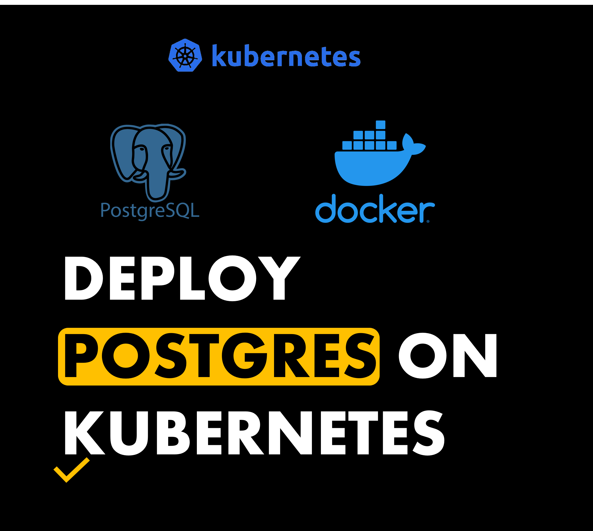

## **Deploy a Postgres DB on Kubernetes**
With initialisation database, schemas, and tables.

---



### **Databases + Kubernetes.. why?**

The 'why' is answerable by simply listing the pros of Kubernetes. 
But the key benefits are:
* Process automation and ease of deployment
* Stable, scalable, and highly available deployments
* Self-Healing capabilities
* Portable to different clouds and environments

Essentially Kubernetes and Databases fit like a hand in a glove. 
Most issues that deployed software face in production is solved or remedied by Kubernetes. 
Manual clean up tasks can be automated, and your application can be scaled to handle more load at different times. These are just some of the great reasons why you might want to deploy your database on Kubernetes. 

You will need:
- Minikube
- Docker Hub Account

Finished Links:
- [Github](https://github.com/mo-justlearnai/Deploy-a-Postgres-DB-on-Kubernetes-)

## **Prior Experience with Docker, Minikube (Kubernetes) is assumed.**

### **PostgreSQL + Kubernetes**

Ok, so a quick overview of how this project will be implemented. 
1. To deploy a PostgreSQL database with Kubernetes (K8) we will need to have a postgres docker image. I will be using an official postgres from docker hub.

2. We will need to connect docker hub account to the local machine we want to push docker images from

3. Building and pushing the docker image to dockerhub as a public repository

4. Start our minikube cluster

5. Apply our Kubernetes file to our cluster 

6. Execute BASH commands in our Database pod to view the configuration 

In one sentence:
We will be deploying a PostgreSQL docker image onto a Kubernetes cluster and viewing the data in that pod.

Note: We will not be provisioning replicas for databases as this introduces a data versioning risk unless replicated stateful sets are used instead of deployments. This is out of the scope of this article. 

Note: Resource limits although vitally important to K8 cluster working as it will not be covered in this article as it’s out of scope. 


## 1. Connect your docker hub account to Docker Desktop
This allows you to build and push images seamlessly.

Run the below command.

```shell
docker login
```


## 2. Build and Push Postgres docker images to dockerhub

Create an empty folder for this project. You can name it anything you like.
Create a folder called 'db'
Crate a file called 'init.sql' inside the folder 'db'

Add the following contents to 'init.sql'

Explanation: This SQL file will be executed when the postgres pod is started up.

**init.sql**
```sql
-- ================================================== 
-- Title: Schema and Tables creation within Database
-- Author: Mattithyahu 
-- Created Date: 07/07/2023  
-- ==================================================

-- Creating Schemas
-- ==================================================

-- Public Schema
CREATE SCHEMA IF NOT EXISTS public;

-- Test Schema
CREATE SCHEMA IF NOT EXISTS test;


-- ==================================================
-- PUBLIC TABLES
-- ==================================================

-- TABLE1
-- ==================================================
CREATE TABLE IF NOT EXISTS public.table1 (
    name VARCHAR(255)  NOT NULL,
    creation_date TIMESTAMP NOT NULL
);

-- JUSTLEARNAI
-- ==================================================
CREATE TABLE IF NOT EXISTS public.justlearnai (
    firstname VARCHAR(255)  NOT NULL,
    creation_date TIMESTAMP NOT NULL
);

-- ==================================================
-- TEST TABLES
-- ==================================================

-- TABLE1
-- ==================================================
CREATE TABLE IF NOT EXISTS test.table2 (
    name VARCHAR(255)  NOT NULL,
    creation_date TIMESTAMP NOT NULL
);

-- JUSTLEARNAI
-- ==================================================
CREATE TABLE IF NOT EXISTS test.justlearnai (
    lastname VARCHAR(255)  NOT NULL,
    creation_date TIMESTAMP NOT NULL
);

```

Now create a folder called 'docker-manifests' 
Create a file called 'Dockerfile.db'

Add the following contents to 'Dockerfile.db'

Explanation: This file is the docker configuration for the docker image. The ENV variables define the database configurations specifically. This should at least be defined in a Kubernetes secrets file for security reasons but this is out of the scope of this article. The COPY command adds the SQL file above into the docker entrypoint folder to be executed on startup.

**Dockerfile.db**
```Dockerfile
# ================================================== 
# Title: Build postgres image 
# Author: Mattithyahu 
# Created Date: 07/07/2023  
# ==================================================

# Pulling the official postgres base image
FROM postgres

# Argument pathtoservice
ARG PATHTOSERVICE=./db

# Naming default database, user, and password
ENV POSTGRES_DB newdb
ENV POSTGRES_USER postgres
ENV POSTGRES_PASSWORD password

# Executing SQL file on startup
COPY $PATHTOSERVICE/init.sql /docker-entrypoint-initdb.d/

```

Finally, let's build and push the docker image to dockerhub.

**Build** Command

```shell
docker build -t justlearnai/postgresdb:latest -f ./docker-manifests/Dockerfile.db .
```


**Push** Command

```shell
docker push justlearnai/postgresdb:latest
```


Great, your docker image should have been pushed to your dockerhub account. 

## 3. Let's start our minikube cluster

minikube start essentially configures kubectl to use our minikube cluster and "default" namespace by default.

Run

```shell
minikube start
```

After this command has run.

Run 

```shell
kubectl get all
```


Your command output may show a few pods, services, deployments etc. You may want to delete this… especially if you will be deploying the postgres pod in the same namespace.

You can delete all kinds by running.

```
minikube delete
```
and then

```shell
minikube start
```

## 4. Apply K8 database config and view created tables

Create a folder called 'kube-manifests'
Create a file called 'postgres.yml' inside the kube-manifests folder.

Add the following contents to 'postgres.yml'

Explanation: This file holds the persistent volume claim, deployment, and service.

**postgres.yml**
```yml
# ======================================================   
# Title: DB PVC, Deployment & Cluster IP Service
# Author: Mattithyahu  
# Created Date: 07/07/2023  
# ======================================================

# Persistent Volume Claim
# ======================================================
apiVersion: v1
kind: PersistentVolumeClaim
metadata:
  name: db-persistent-volume-claim
spec:
  accessModes:
    - ReadWriteOnce
  resources:
    requests:
      storage: 100M
---

# Deployment
# ======================================================
apiVersion: apps/v1
kind: Deployment
metadata:
  name: db-deployment
spec:
  replicas: 1
  selector:
    matchLabels:
      component: db
  template:
    metadata:
      labels:
        component: db
    spec:
      volumes:
        - name: db-data
          persistentVolumeClaim:
            claimName: db-persistent-volume-claim
      containers:
        - name: db-container
          image: justlearnai/postgresdb:latest
          imagePullPolicy: "Always"
          ports:
            - containerPort: 5432

---

# Cluster IP Service
# ======================================================
apiVersion: v1
kind: Service
metadata:
  name: db-cluster-ip-service
spec:
  type: ClusterIP
  selector:
    component: db
  ports:
    - port: 5432
      targetPort: 5432

```

To apply the file to our cluster
Run 

either

```shell
kubectl apply -f ./kube-manifests/
```

This applies all files in the folder.

or

```shell
kubectl apply -f ./kube-manifests/postgres.yml
```

This applies the one file.

Whichever you choose the output from the command should be look like below.


Lastly let's find the postgres pod and execute bash commands to allow us to view the databases, schemas, and tables in the pod.

1. Run kubectl get pods to view the pods

```bash
kubectl get pods
```

2. Copy the name of the pod

3. Add the name of your pod to the command and run it

**kubectl exec -it [YOUR POD NAME] -- bash**

```
kubectl exec -it db-deployment-69959d6f4-rh92x -- bash
```

4. Run psql command to access database

Depending on your configuration run the below psql command to access the database

psql [POSTGRES_DB] [POSTGRES_USER]
```
psql newdb postgres
```

5. Run \dt to view all tables

```shell
\dt
```


5. Run \dn to view all schemas

```shell
\dn
```

You can run normal SQL queries to query or insert data into tables now.

Thanks for reading.

---
<!-- DONE -->
